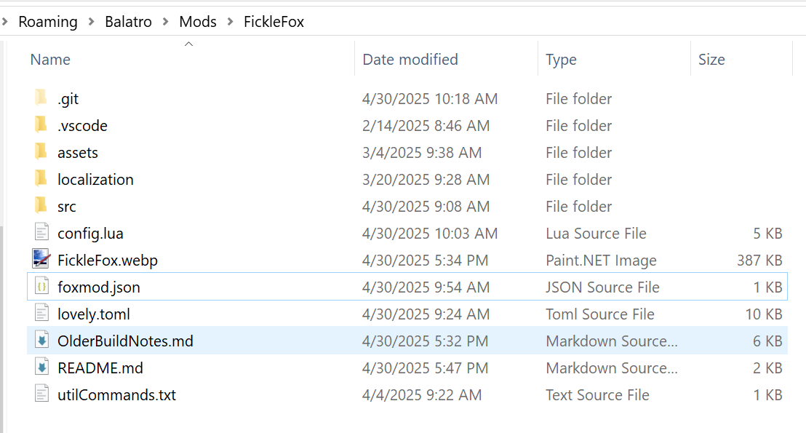

# Fickle Fox

An animal themed, vanilla friendly, configurable Balatro mod!

*Report issues or suggest ideas in the Discord!  Or file an issue on the repo!*

What's the purpose of this mod
====================
The themes and goals here are cute art and fun new options for all phases of the game, *especially late game / naninf*.  

I felt that it would be fun if there were more long term options available for late / end-game, and especially if these new jokers were fun or changed the way you play the game!

What's in this mod
====================
This mod contains a lot of fun stuff, including 40+ fun and original Joker ideas, all of which have lovingly handcrafted art and deep interactions with each other as well as the full set of original Jokers from the base game!  

### 40+ new jokers!
### 5+ new boosters
### New Editions, Vouchers, Decks and more!

    
<b>Mod Spoilers</b>

    

    * Golden Repeater - a golden retriever!  Has a chance to repeat gold cards and sometimes make a copy of them!
    * Lucky Repeater - an irish setter,  Has a chance to repeat lucky cards and sometimes make a copy of them!
    * Pear Pair - a pair of birds.  gains in strength when you play multiple cards at a time, like pairs, two pairs or more
    * Fickle Fox - a fox with a stolen bag of money - fickley applies gold seals to your cards
    * Benevolance - a fox deity (love this design) - applies additional boons to your Gold Sealed cards when they are held in hand
    * A Kuma - a loveable bear with a strange connection to the number 10
    * ?????? - goes even further beyond
    * Hachiko - a dog on the subway - interacts with played 8's and 5's, like Walkie Talkie
    * Sun and Moon - a Hemmingway's Cat and Ninetailed Fox - interacts with played 9's and 6's, like Hachiko
    * Felicette - the first cat in space! Try it for yourself
    * Sonar Bat - helps you discover information about unplayed cards in your deck
    * Bandit Loach - a cute little loach fish - steals your money but sometimes upgrades your played hand
    * Holowing Owl - a holographic owl - is always enhanced and interacts nicely with enhanced cards
    * Death of Rats - every x hands, will 'kill' a played High Card.  Gains in power when allowed to trim the deck.  Resets if other than a high card is played
    * Tacocat - a cat taco - rewards played palindromes

 

## To do

    
<b>Contains Joker Spoilers</b>

    * Fix Creeper, it should explode    
    * Add progression - unlock system!    
    * Caffeine is a great option for a retrigger joker, it's chemical compound is C8H10N4O2 so it would retrigger 
        10, 8, 4 and 2's

 

## Special Thanks

* Thanks to **OhPahn** for some programming tips especially around custom sounds, and for contributing an adorable doggo joker!  You can learn more about him here, [be sure to check out his music](https://linktr.ee/ohpahn) and also his own Balatro mod [OhPahndora's Box, with plenty of original tunes!](https://github.com/ohpahn/opandoras-box) 

* Special thanks to **MarioFan597** for his very helpful artistic advice and guidance, and deep knowledge of the Balatro art style and for contributing two jokers and offering advice on countless others.  You can read more from them here, and be sure to check out their very cool Cryptid Friendly mod: [MarioFan's Ascensio Mod - Github](https://github.com/MarioFan597/Ascensio)

* Special thanks to my real life best friend **Akravator** for contributing one of the Secret Jokers in this mod!

## Extra Special Thanks

And my deepest thanks to my wife, Linzra for brainstorming and creating 95% of all of the art in this mod!!! You can read more about her here

Installation Instructions
==========================

[Setup Lovely and Steammodded following this guide on Steam](https://steamcommunity.com/sharedfiles/filedetails/?id=3400691352)

Download the newest release from <x>

Navigate to this path (using the Run Command box or paste into explorer)

* %AppData%/Balatro
* If you're not familiar with app variables you can also navigate here
* * C:\Users\<YourUserName>AppData\Roaming\Balatro

Create a new folder at this path if it does not exist yet:
 Mods

Unzip the release, it should look like this when done

